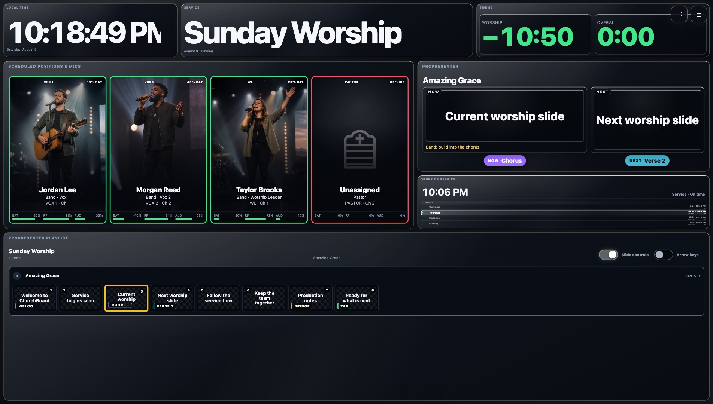
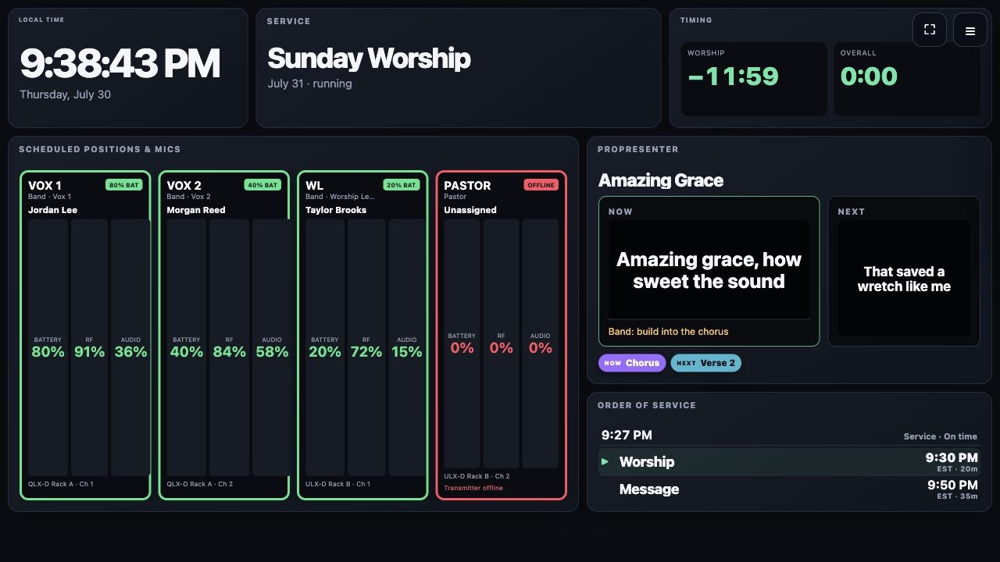
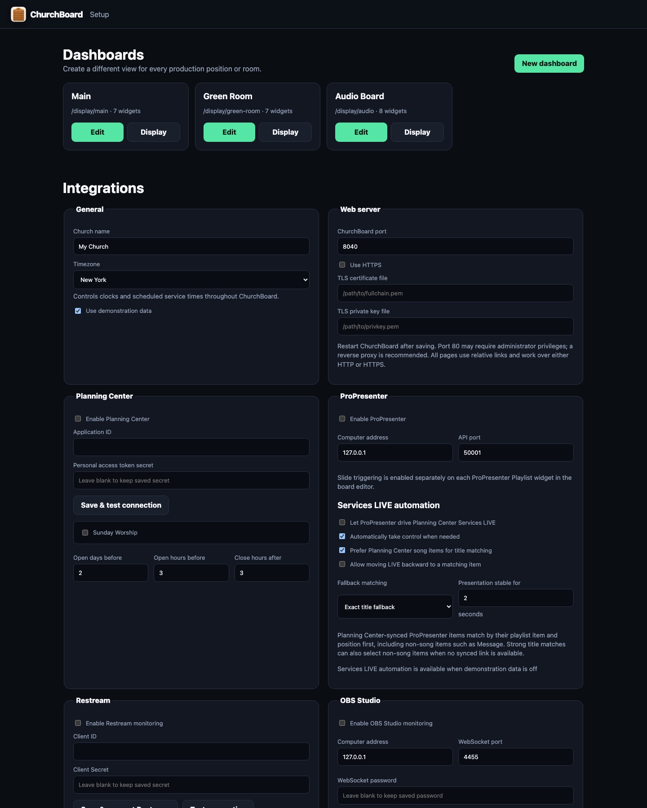
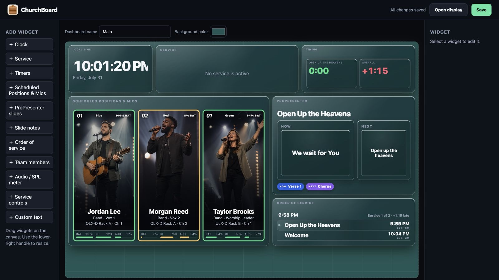

# ChurchBoard

ChurchBoard is a cross-platform production dashboard for churches. It combines Planning Center schedules and people, ProPresenter slides and service flow, and Shure QLX-D/ULX-D microphone telemetry in configurable displays for the stage, green room, audio booth, and production team.


While this repository is private, GitHub requires testers to sign in before these download links work.



## What ChurchBoard shows

- Photo-forward scheduled-position and microphone cards, including unassigned positions
- Shure QLX-D and ULX-D battery, RF, audio, transmitter, and online/offline status
- Current and next ProPresenter slides as text or slide images
- ProPresenter item title, part labels and colors, slide number, and notes
- Planning Center order of service, estimated clock times, leaders, and mapped microphones
- Current item and overall service timing
- Team-member lists with photos, filtered by team and position
- Browser-based SPL meter and service-control buttons
- A WYSIWYG dashboard editor with independent layouts for each destination




## Download ChurchBoard

Choose your computer and click its download link:

| Your computer | Download |
| --- | --- |
| **Windows 10 or 11** | **[Download the Windows installer (.exe)](https://github.com/wtapper89/ChurchBoard/releases/latest/download/ChurchBoard-0.1.2-Windows-x64-Setup.exe)** |
| **Mac with Apple silicon** — M1, M2, M3, M4, or newer | **[Download the Apple silicon Mac disk image (.dmg)](https://github.com/wtapper89/ChurchBoard/releases/latest/download/ChurchBoard-0.1.2-macOS-arm64.dmg)** |
| **Mac with an Intel processor** | **[Download the Intel Mac disk image (.dmg)](https://github.com/wtapper89/ChurchBoard/releases/latest/download/ChurchBoard-0.1.2-macOS-x86_64.dmg)** |
| **Ubuntu or Debian Linux** | **[Download the Linux installer (.deb)](https://github.com/wtapper89/ChurchBoard/releases/latest/download/ChurchBoard-0.1.2-Linux-amd64.deb)** |
| **Other 64-bit desktop Linux** | **[Download the portable Linux package (.tar.gz)](https://github.com/wtapper89/ChurchBoard/releases/latest/download/ChurchBoard-0.1.2-Linux-x86_64.tar.gz)** |

Not sure which Mac you have? Choose **Apple menu → About This Mac**. If it says **Chip**, use Apple silicon. If it says **Processor**, use Intel.

**Raspberry Pi:** jump to the [one-command Raspberry Pi installer](#raspberry-pi).

[View all v0.1.2 downloads and release notes](https://github.com/wtapper89/ChurchBoard/releases/tag/v0.1.2)

## Install

Every desktop installer configures ChurchBoard to start automatically. Opening ChurchBoard from the Start menu, Applications folder, or desktop menu opens Setup in the default browser.

### Raspberry Pi

For Raspberry Pi OS:

```bash
curl -fsSL https://raw.githubusercontent.com/wtapper89/ChurchBoard/main/installers/raspberry-pi/install.sh | bash
```

Add `--kiosk` to open the Main dashboard fullscreen after desktop login:

```bash
curl -fsSL https://raw.githubusercontent.com/wtapper89/ChurchBoard/main/installers/raspberry-pi/install.sh | bash -s -- --kiosk
```

See [Installation](docs/INSTALLATION.md) for detailed steps, updates, automatic-start behavior, and uninstall instructions.

## First-time setup

Open `http://127.0.0.1:8040/admin`, turn off demonstration data, and configure Planning Center first. ChurchBoard stores settings only on the computer running it.



See [Configuration](docs/CONFIGURATION.md) for Planning Center personal-access-token setup, service selection, position and microphone mapping, ProPresenter, Services LIVE automation, dashboards, and the custom unassigned icon.

## Dashboard editing

Each dashboard has a stable URL. Add widgets from the palette, drag and resize them on the canvas, then configure the selected widget in the inspector. Text, cards, photos, and status displays scale with their widget.



## Local development

ChurchBoard requires Python 3.11 or newer:

```bash
python3 -m venv .venv
. .venv/bin/activate
pip install -r requirements.txt
python run.py
```

Manual startup opens Setup automatically. Use `python run.py --background` for a headless service.

Run tests with:

```bash
python -m unittest discover -s tests
```

See [Development and release builds](docs/DEVELOPMENT.md) for platform build commands and release automation.

## Security

Planning Center credentials remain in the local ChurchBoard data directory and are excluded from Git. ChurchBoard is intended for a trusted production LAN and does not yet provide its own login screen or TLS termination. Read [SECURITY.md](SECURITY.md) before exposing it beyond that network.
