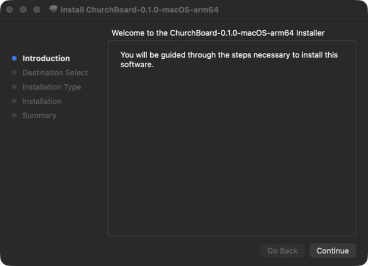
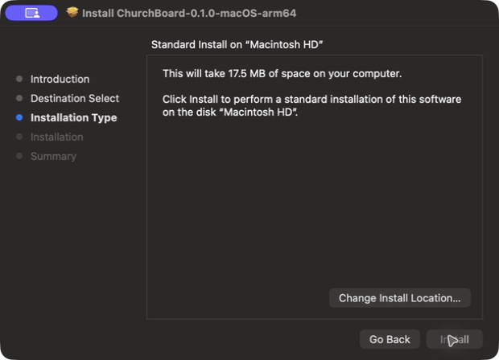

# Installing ChurchBoard

ChurchBoard runs a small local web server and displays its interface in a browser. The packaged desktop applications include Python, so end users do not need to install Python.

## Direct installer downloads

| Platform | Installer |
| --- | --- |
| Windows 10 or 11 | **[Download for Windows (.exe)](https://github.com/wtapper89/ChurchBoard/releases/latest/download/ChurchBoard-0.1.0-Windows-x64-Setup.exe)** |
| Apple silicon Mac — M1, M2, M3, M4, or newer | **[Download for Apple silicon Mac (.pkg)](https://github.com/wtapper89/ChurchBoard/releases/latest/download/ChurchBoard-0.1.0-macOS-arm64.pkg)** |
| Intel Mac | **[Download for Intel Mac (.pkg)](https://github.com/wtapper89/ChurchBoard/releases/latest/download/ChurchBoard-0.1.0-macOS-x86_64.pkg)** |
| Ubuntu or Debian Linux | **[Download for Linux (.deb)](https://github.com/wtapper89/ChurchBoard/releases/latest/download/ChurchBoard-0.1.0-Linux-amd64.deb)** |
| Other 64-bit Linux | **[Download the portable Linux package (.tar.gz)](https://github.com/wtapper89/ChurchBoard/releases/latest/download/ChurchBoard-0.1.0-Linux-x86_64.tar.gz)** |

[See every v0.1.0 download](https://github.com/wtapper89/ChurchBoard/releases/tag/v0.1.0)

After installation, Setup is available at:

```text
http://127.0.0.1:8040/admin
```

Another computer on the same trusted network can use:

```text
http://CHURCHBOARD-COMPUTER-IP:8040/display/main
```

## Windows 10 and 11

1. Use the **Download for Windows** link above.
2. Open `ChurchBoard-0.1.0-Windows-x64-Setup.exe`.
3. Run the installer. Leave **Start ChurchBoard automatically when I sign in** checked.
4. When Windows Firewall asks, allow ChurchBoard on **Private networks** if displays on other production computers need to connect.
5. ChurchBoard starts and opens Setup.

ChurchBoard installs for the current user in `%LOCALAPPDATA%\Programs\ChurchBoard`. Its settings are in `%USERPROFILE%\.churchboard`.

To open it later, choose **ChurchBoard** from the Start menu. To uninstall, use **Settings → Apps → Installed apps → ChurchBoard**. Uninstalling removes the application and startup entry but preserves `.churchboard` settings so an update does not erase configuration.

## macOS

Choose the package that matches the Mac:

- `arm64` for Apple silicon (M1, M2, M3, M4, and newer)
- `x86_64` for Intel Macs

1. Use the matching **Download for Mac** link above.
2. Open the downloaded `.pkg` and follow the Installer prompts.
3. ChurchBoard launches Setup and will start automatically at login.



Continue to **Installation Type**, confirm that the destination is the Mac's startup disk, and choose **Install**.



ChurchBoard installs in `/Applications/ChurchBoard.app`. Settings are in `~/.churchboard`, and logs are in `~/Library/Logs/ChurchBoard.log` and `ChurchBoard.error.log`.

Development builds are ad-hoc signed. If macOS blocks a downloaded package before official Developer ID signing and notarization are configured, Control-click the package, choose **Open**, and confirm only if it came from the official ChurchBoard release.

To uninstall, run **Uninstall ChurchBoard.command** from the disk image. The uninstaller removes the app and login service but preserves `~/.churchboard`.

## Debian, Ubuntu, and Raspberry Pi OS desktop

1. Use the **Download for Linux (.deb)** link above.
2. Install it:

   ```bash
   sudo apt install ./ChurchBoard_<version>_<architecture>.deb
   ```

3. The system service starts immediately and at boot.
4. Open `http://127.0.0.1:8040/admin`.

The package runs ChurchBoard as a dedicated `churchboard` system user. Settings are stored in `/var/lib/churchboard`, and logs are available with:

```bash
journalctl -u churchboard
```

Remove it with:

```bash
sudo apt remove churchboard
```

The settings directory is retained unless it is removed manually.

## Other desktop Linux distributions

1. Download and unpack the Linux `.tar.gz`.
2. In the unpacked directory, run:

   ```bash
   ./install.sh
   ```

3. ChurchBoard is installed for the current user and starts as a user service.

The installer places the app in `~/.local/share/churchboard`, adds a desktop-menu entry, and enables `churchboard.service`. Settings are in `~/.local/share/churchboard/data`.

Check status or logs with:

```bash
systemctl --user status churchboard
journalctl --user -u churchboard
```

Run the included `uninstall.sh` to remove the application and startup service while retaining settings.

## Raspberry Pi one-command installer

On 64-bit or 32-bit Raspberry Pi OS, open Terminal as the normal desktop user and run:

```bash
curl -fsSL https://raw.githubusercontent.com/wtapper89/ChurchBoard/main/installers/raspberry-pi/install.sh | bash
```

For a dedicated display, install Chromium kiosk startup too:

```bash
curl -fsSL https://raw.githubusercontent.com/wtapper89/ChurchBoard/main/installers/raspberry-pi/install.sh | bash -s -- --kiosk
```

The Pi installer:

- installs OS prerequisites;
- downloads ChurchBoard and creates a private Python environment;
- creates a boot-time system service under the current user;
- preserves the previous installation if an update fails;
- optionally starts Chromium fullscreen after desktop login.

Settings remain in `~/.local/share/churchboard/data`. Update by running the same command again. Remove ChurchBoard with:

```bash
~/.local/share/churchboard/app/installers/raspberry-pi/uninstall.sh
```

If the source copy is no longer present, download `installers/raspberry-pi/uninstall.sh` from the same release and run it.

## Network checklist

- Give the ChurchBoard computer a DHCP reservation or static address.
- Keep ChurchBoard, Planning Center access, ProPresenter, and Shure receivers on a trusted production network.
- Permit inbound TCP port `8040` only from devices that need the dashboard.
- ChurchBoard connects to ProPresenter's configured API port and Shure receivers on TCP port `2202`.
- Do not forward port `8040` directly from the internet.

## Automatic startup summary

| Platform | Startup method | Starts when |
| --- | --- | --- |
| Windows | Current-user Run entry | User signs in |
| macOS | LaunchAgent | User signs in |
| Linux tar installer | systemd user service | User session starts |
| Debian/Ubuntu package | system systemd service | Computer boots |
| Raspberry Pi | system systemd service | Pi boots |

The background service does not continually open browser windows. Launching ChurchBoard manually opens Setup.
